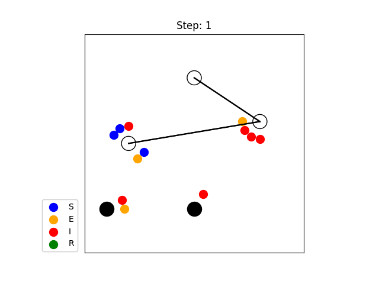

# SEIR Markov Lockdown

Markov SEIR model with lockdown.



## Installation

- Python version: ^3.10

```sh
# pip
pip install git+https://github.com/jjj999/SEIR-Markov-lockdown.git

# pipx (only for using the app)
pipx install git+https://github.com/jjj999/SEIR-Markov-lockdown.git
```

## Usage

### Run with taking snapshots

1. Copy and edit the template files:
   1. [snapshot_config.yaml](./examples/template/snapshot_config.yaml): Config file for snapshots.
   2. [cities.csv](./examples/template/cities.csv): Definition of cities.
   3. [connections.csv](./examples/template/connections.csv): Definition of city connections.
   4. [city_groups.csv](./examples/template/city_groups.csv): Definition of city groups.
   5. [people.csv](./examples/template/people.csv): Definition of people.
2. Run simulation:
  ```sh
  cd /path/to/directory/   # if needed
  seir-markov-lockdown snapshot snapshot_config.yaml
  ```

### Run with plotting

1. Copy and edit the template files:
   1. [plot_config.yaml](./examples/template/plot_config.yaml): Config file for plotting.
   2. [cities.csv](./examples/template/cities.csv): Definition of cities.
   3. [connections.csv](./examples/template/connections.csv): Definition of city connections.
   4. [city_groups.csv](./examples/template/city_groups.csv): Definition of city groups.
   5. [people.csv](./examples/template/people.csv): Definition of people.
2. Run simulation:
  ```sh
  cd /path/to/directory/   # if needed
  seir-markov-lockdown plot plot_config.yaml
  ```

## Examples

- [simple](./examples/simple/): Example with the simple definitions.
- [tokyo](./examples/tokyo/): Simulation based on travel between 30 major stations in Tokyo.
